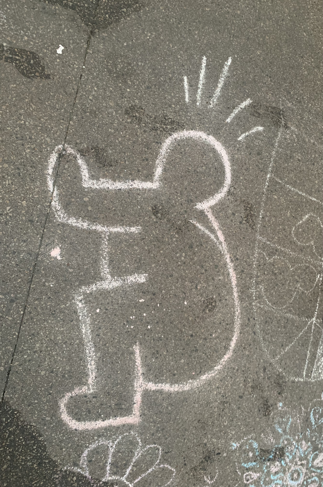
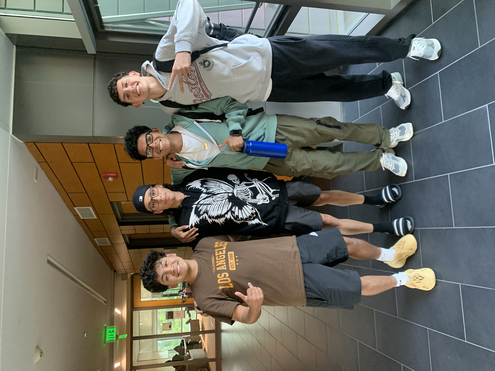
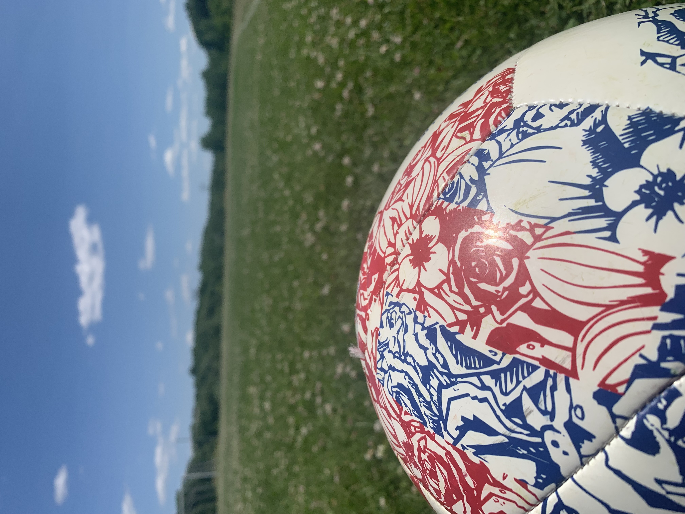
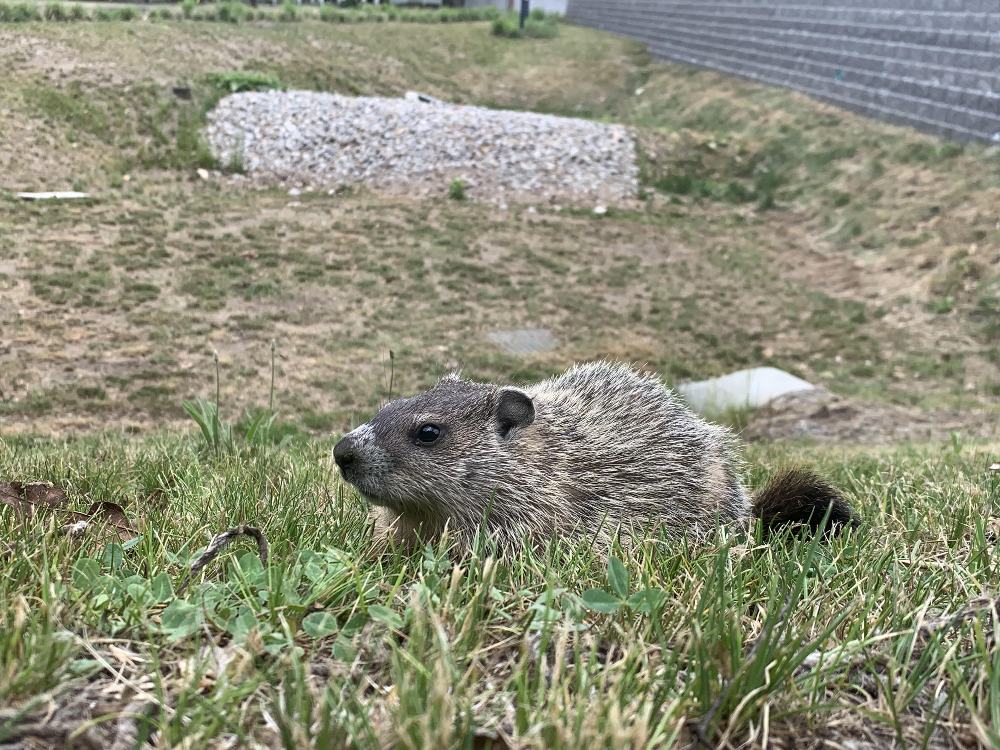
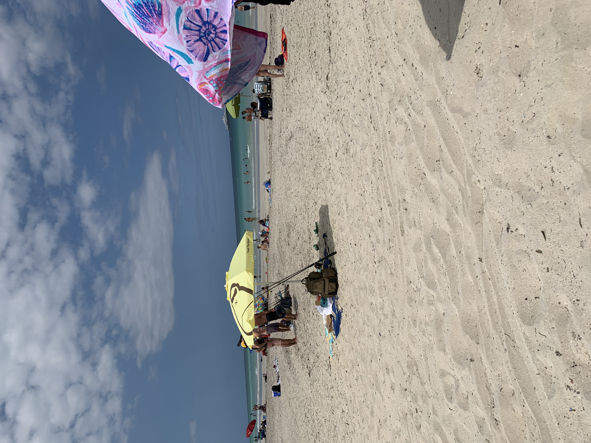
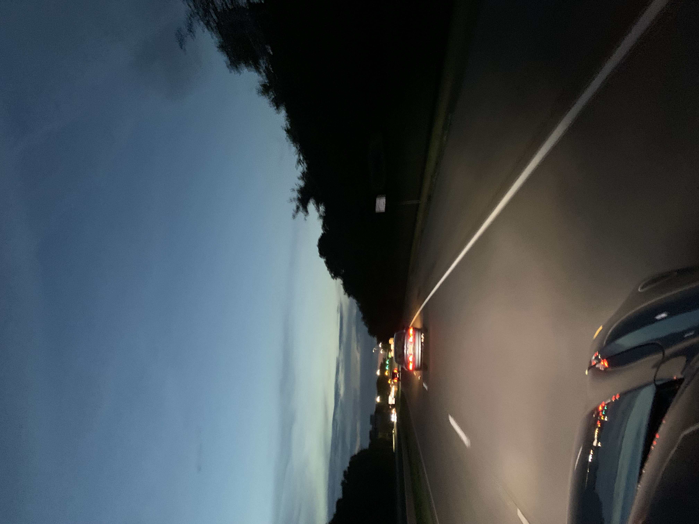
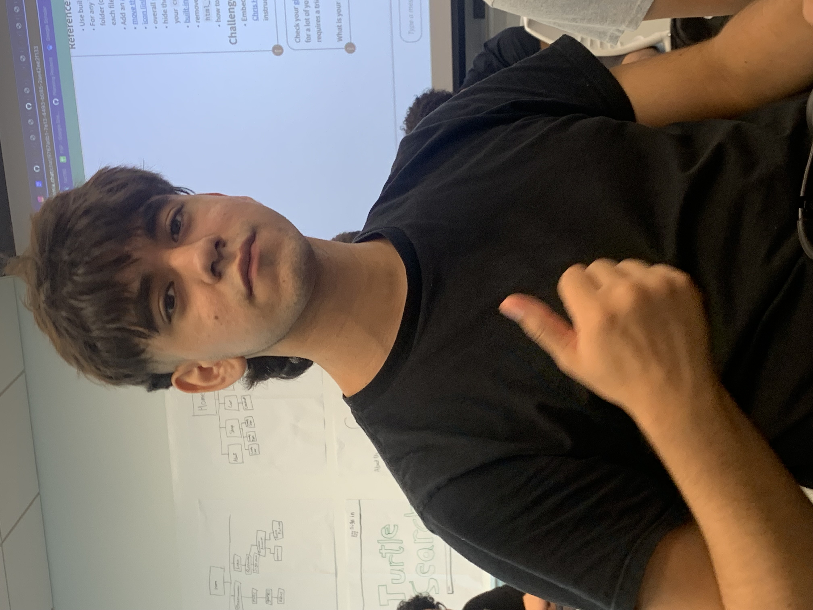
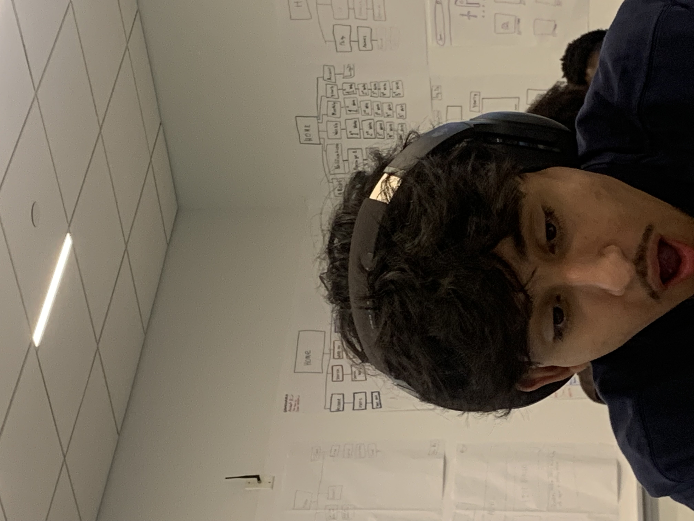
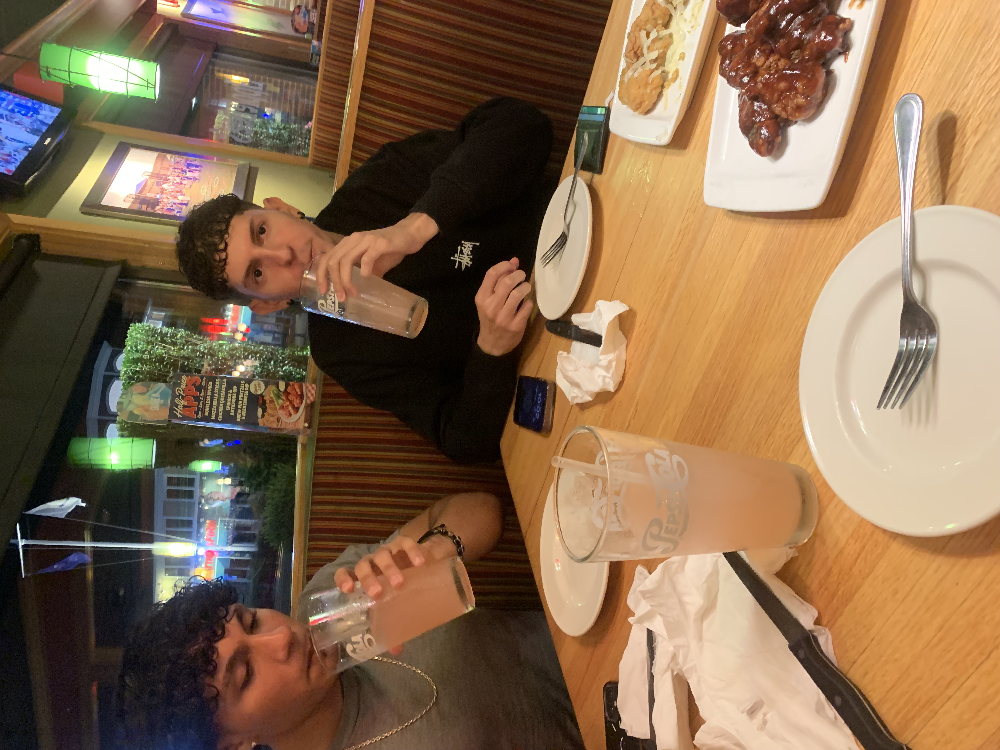

# Pechakucha Slideshow

<div id="slideshow">

```{include} _static/play_pause.html
```

```{card} 
:class-card: slide

```

```{card}
:class-card: slide

```

```{card}
:class-card: slide

```

```{card}
:class-card: slide

```

```{card}
:class-card: slide

```

```{card}
:class-card: slide

```

```{card}
:class-card: slide

```

```{card}
:class-card: slide

```

```{card}
:class-card: slide

```

```{card}
:class-card: slide

```

```{card}
:class-card: slide

```

```{card}
:class-card: slide

```

</div>